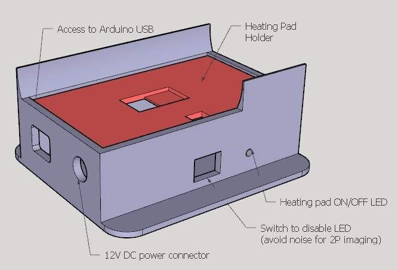

# Heating pad for mice

This folder contains the projects for an Arduino-controlled 3D printed heating pad for anesthetized mice.  
Can be used for surgeries or for head-fixed experiments (e.g., two-photon recordings in anesthetized mice).

## Content

* *.STL* Files to 3D print both the base and the plate for the heating pad;
* *.ino* file containing the Arduino firmware for running the device. It is
tested on arduino nano devices.

## The device

## What you need to build it

1. 3D print the **enclosure**.
2. 
